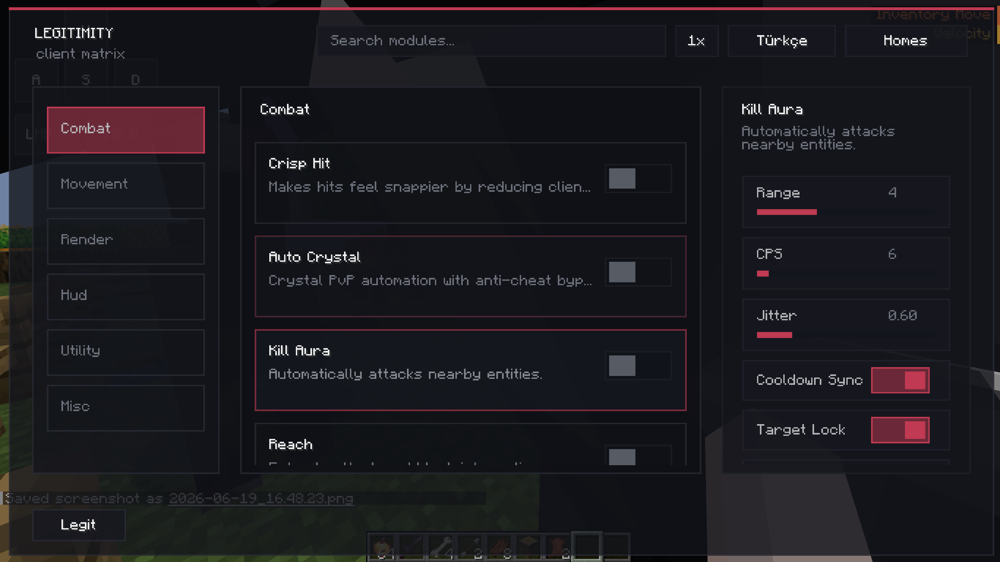

# Legitimity Client

> **Note:** This mod was made entirely with artificial intelligence.
> If you want a new feature, open an issue in the **Issues** tab and describe what you want added.

Legitimity Client is a Fabric client-side utility mod for Minecraft 1.21.4. It includes movement, render, combat, HUD, and utility modules that can be toggled from the in-game click GUI.

## Screenshot

Add your screenshot here:



## Features

- **Landing Marker** - predicts and marks where your current fall path will land.
- **Pearl Landing Predictor** - draws an ender pearl trajectory and landing box.
- **Spin** - client-side troll visual module that spins held items, players, mobs, and biped heads.
- **Auto EXP** - throws experience bottles downward when armor or items drop below the configured durability threshold.
- **Air Jump** - lets you jump while already airborne.
- **Auto Tool** - selects the best hotbar tool for blocks and entities, with special handling for shears, bamboo, and combat.
- **Scaffold** - places blocks under and ahead of you while bridging.
- **Parkour** - automatically jumps at block edges.
- **Freecam** - move the camera independently from the player.
- **Freelook** - look around without rotating the player.
- **Full Bright** - improves visibility by faking night vision client-side.
- **ESP / Chams / Hitbox Aura** - render-focused target and outline helpers.
- **Kill Aura / Auto Crystal / Reach / Velocity** - combat modules with configurable behavior.
- **Inventory Move** - allows movement while inventory screens are open.
- **Low Fire / Clear Water / No Particles** - visual cleanup modules.
- **Motion HUD / Array List** - HUD modules for movement and enabled-module display.
- **Trust List / Echo Bot / Hand Style / Rapid Equip / Blade Stance / Chroma Hurt / Time Warp** - extra utility, render, and cosmetic modules.

## Usage

- Open the click GUI with **Right Shift**.
- Toggle modules from the GUI.
- Configure module settings and keybinds in-game.

## Requirements

- Minecraft **1.21.4**
- Fabric Loader **0.19.1**
- Fabric API **0.119.4+1.21.4**

## Build

```powershell
.\gradlew.bat build
```

The built mod jar will be in:

```text
build/libs/legitimity-1.0.0.jar
```

## Download

Releases are available here:

https://github.com/MaviBiciriq/legitimity-client/releases

## License

This project includes the original template license files. See [LICENSE](LICENSE).
